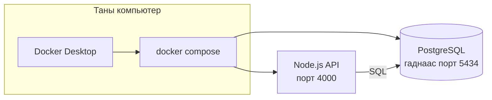
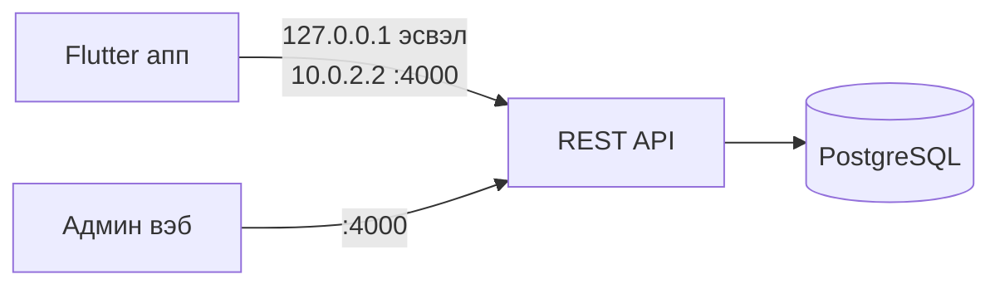
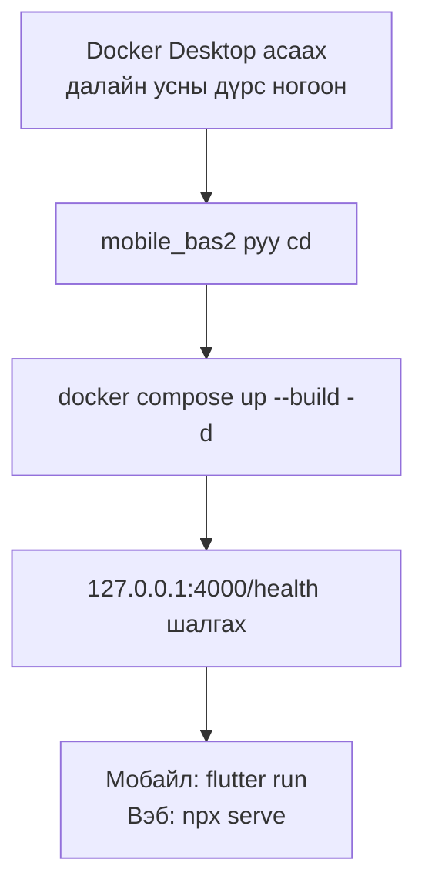

# Parking system (diploma)

Зогсоолын систем: **Flutter** хэрэглэгчийн апп, **static HTML/JS** админ вэб, **Docker** дээр ажилладаг **Node.js + PostgreSQL** backend.

Репозитор: [https://github.com/bluebell1114/parking_sysytem1](https://github.com/bluebell1114/parking_sysytem1)

## Юу юу байдаг вэ

| Хавтас | Үүрэг |
|--------|--------|
| **`mobile_bas2/`** | Docker Compose: PostgreSQL + REST API (`JWT`, бүртгэл, зогсоол, захиалга, түрийвч, төлбөр). Порт: API **4000**, DB **5434**. |
| **`parking-mobile/`** | Flutter апп (Android / Web / Windows). Газрын зураг: OpenStreetMap (`flutter_map`). Backend руу HTTP. |
| **`parking-website/`** | Админ вэб (`index.html`, `dashboard.html`, `js/app.js`). Static серверээр асаана. |

Өмнө Firebase ашиглаж байсан хэсгийг **нэг Docker API** руу нэгтгэсэн тул мобайл болон вэб **ижил өгөгдлийг** API-аас уншина.

## Docker ашиглах (дэлгэрэнгүй)

**Docker** нь `mobile_bas2` хавтас дахь `docker-compose.yml` файлаар хоёр **контейнер** зэрэг асаана: **PostgreSQL** (өгөгдлийн сан) болон **Node.js API** (REST сервер). Та зөвхөн Docker Desktop асаагаад доорх тушаалуудыг ажиллуулна.

### Зурагтай тайлбар

Доорх зурагнууд [GitHub дээрх README](https://github.com/bluebell1114/parking_sysytem1/blob/main/README.md)-г нээхэд **автоматаар** зураг болж харагдана (Mermaid). Орчин нээлттэй болохгүй бол VS Code/Cursor-д «Mermaid» өргөтгөө суулгасан ижил файлыг нээнэ.

**1) Компьютер дотор юу асааж байгаа вэ**



**2) Апп, вэб, серверийн холбоо**



**3) Анхныхны дараалал**



**Docker Desktop-ийн цонхоор шалгах:** зүүн цэснээс **Containers** — `mobile_bas2_postgres`, `mobile_bas2_api` хоёр ногоон төлөвтэй байвал зөв.

### Өмнө нь

- Windows дээр [Docker Desktop](https://www.docker.com/products/docker-desktop/) суусан, асаасан (доод талын whale дүрс ногоон).
- Терминал дээр төслийн **`mobile_bas2`** хавтас руу орно (жишээ: репозиторийг татаад `parking_sysytem1-main/mobile_bas2`).

### Анх удаа эсвэл код өөрчлөгдсөн үед — барьж асаах

`--build` нь API-ийн Docker **image**-ийг дахин угсарна. ` -d` нь дэвсгэрт асаана (терминалыг чөлөөлнө).

```bash
cd mobile_bas2
docker compose up --build -d
```

### Дараа нь зөвхөн асаах (өөрчлөлтгүй бол)

```bash
cd mobile_bas2
docker compose up -d
```

### Порт ба шалгалт

| Юу | Хаяг |
|----|------|
| REST API | `http://127.0.0.1:4000` |
| Эрүүл мэнд | `http://127.0.0.1:4000/health` → `{"ok":true}` |
| PostgreSQL (гаднаас) | `localhost:5434`, хэрэглэгч `parking`, нууц `parking`, DB `parking_db` |

Өгөгдөл **Docker volume** (`mobile_bas2_pgdata`) дээр хадгалагдана — контейнерыг зогсоосон ч дахин `up` хийхэд үлдэнэ. Бүрэн цэвэрлэхийг хүсвэл доорх `down -v` хэрэглэнэ.

### Лог харах, зогсоох

```bash
cd mobile_bas2
docker compose logs -f api      # API-ийн лог (Ctrl+C зогсооно)
docker compose ps               # Ажиллаж буй контейнерууд
docker compose stop             # Зогсоох (өгөгдөл хадгалагдана)
docker compose down             # Контейнер устгах, сүлжээ чөлөөлөх
docker compose down -v          # Дээр нь volume устгах = DB хоосорно (анхаар!)
```

### Алдаа гарвал

- `port is already allocated` — 4000 эсвэл 5434 порт өөр програмаар эзлэгдсэн байна; тэр үйлчилгээг зогсоо эсвэл `docker-compose.yml`-д порт солино.
- API ачаалахгүй — `docker compose logs api` үзэж, `db` эхлээд **healthy** болсны дараа `api` дэвшинэ.

## Backend асаах (товч)

1. Docker Desktop нээлттэй, `mobile_bas2` дотор: `docker compose up --build -d`
2. `http://127.0.0.1:4000/health` шалгана.

## Мобайл ажиллуулах

```bash
cd parking-mobile
flutter pub get
flutter run
```

- **Вэб (Chrome):** API хаяг: `http://127.0.0.1:4000`
- **Android эмулятор:** `10.0.2.2:4000` (апп дотор тохируулсан)
- **Бодит утас:** PC-тэй ижил сүлжээнд компьютерын LAN IP + `:4000` — шаардлагатай бол `flutter run --dart-define=API_BASE_URL=http://Таны_IP:4000`

## Вэб админ ажиллуулах

```bash
cd parking-website
npx --yes serve .
```

Хөтөчөөр гарсан хаяг (ихэвчлэн `http://localhost:3000`) нээнэ. Нэвтрэхийн өмнө **backend заавал** ассан байх.

## Нэвтрэх (жишээ)

- Анхны суулгах үед API **seed** хийгдэнэ: админ **`admin@greenpark.com` / `admin123`** (зөвхөн хоосон DB-д).
- Бусад хэрэглэгчийг аппын **Бүртгэл**-ээр үүсгэнэ.

## Техникийн товч

- **API:** Express, `bcrypt`, JWT, PostgreSQL транзакц (түрийвч, захиалга, зогсоолын сул орон).
- **Мобайл:** `shared_preferences` (session), `http`, `flutter_map`, `url_launcher` (банкны холбоос).

Эх хавтсанд үлдсэн хуучин нэг түвшний `.dart` файлууд түүхэн үлдэгдэл байж болно; идэвхтэй хөгжүүлэлт **`parking-mobile/`** болон **`parking-website/`** дотор хийгдэнэ.
